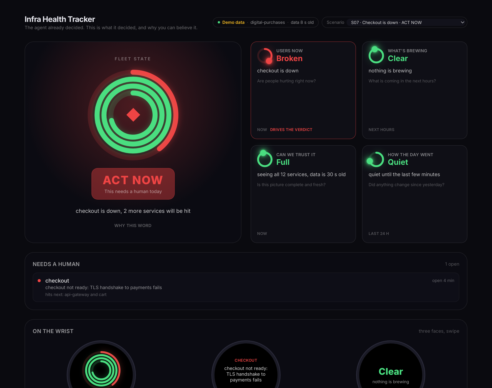

# daedalus-infra-health

Infra Health Tracker для хакатону «Self-Aware Infrastructure». Фітнес-трекер для інфраструктури: не дашборд, з якого інженер сам вичитує причину, а екран, який показує рішення, вже ухвалене агентом Triage, і підстави йому вірити.

Застосунок, код і документи англійською, бо каталог метрик і еталонний екран організаторів теж англійські. Цей файл українською.



## Мета

Інженер відкриває трекер вранці і після релізу. За кілька секунд він має побачити одне з трьох:

| Слово на екрані | Рішення |
| --- | --- |
| **ALL CLEAR** | нічого не робити |
| **SCHEDULE** | запланувати роботу, не сьогодні |
| **ACT NOW** | втрутитись зараз |

Плюс службовий стан **BLIND**: даним не можна вірити, спочатку полагодити збір.

На головному екрані пʼять показників, і жоден із них не є сирою метрикою:

1. **Fleet state**: одне слово, згортка чотирьох інших за правилами пріоритету.
2. **Users now**: чи страждають люди прямо зараз (RED як стан).
3. **What's brewing**: єдиний показник із майбутнього (передвісники агента плюс тиск ресурсів).
4. **Can we trust it**: чи є потік даних і чи повний він.
5. **How the day went**: цінність у спокійний день, а також тиха регресія після релізу.

## Як переглянути прототип

Потрібен лише Docker.

```bash
docker compose up -d --build
```

Після цього трекер відкривається на http://localhost:8080. Якщо порт зайнятий, задайте інший:

```bash
TRACKER_PORT=8088 docker compose up -d --build
```

Зріз перемикається списком у шапці або параметром URL. Drill-in відкривається дотиком до плитки, кільця або слова, а також параметром `drill`:

```
/?scenario=s07_outage
/?scenario=s09_precursor_imminent&drill=forecast
```

Значення `drill`: `users`, `forecast`, `trust`, `day`, `verdict`. Готові PNG усіх одинадцяти зрізів і пʼяти drill-in лежать у [design/](design/).

Після злиття в `main` той самий прототип збирається на GitHub Pages воркфлоу [pages.yml](.github/workflows/pages.yml). Там немає бекенду, тому моделі екрана експортуються в статичний JSON тим самим engine, і фронт читає їх замість API.

## Як відтворити сценарії

Правила пʼяти показників живуть в одному місці, [backend/engine.py](backend/engine.py), а всі пороги в [backend/thresholds.py](backend/thresholds.py). Їх перевіряють 148 тестів:

- рішення, стани і рядок причини на екрані для кожного з одинадцяти зрізів;
- обидва боки кожного порога (0.49% і 0.5%, 29 і 30 хвилин попередження, 94% і 95% покриття);
- 35 видів неповних даних на двох зрізах: бекенд жодного разу не падає і завжди дає рішення;
- HTTP API, контракт відповіді, живий режим проти підробленого core.

```bash
docker run --rm -v "$PWD:/src" -w /src python:3.12-slim sh -c "pip install -q -r backend/requirements-dev.txt && python -m pytest -q"
```

У Git Bash на Windows додайте перед командою `MSYS_NO_PATHCONV=1`, інакше шлях `/src` буде перетворено.

Те саме таблицею, без Docker, на Python 3.12+ без залежностей:

```bash
python mock_data/evaluate.py
```

```
scenario                  users       forecast    trust       day           verdict       ok
s01_calm                  ok          clear       full        quiet         all_clear     ✓
s03_release_regressed     ok          clear       full        regressed     schedule      ✓
s05_agent_disconnected    unknown     unknown     blind       unknown       blind         ✓
s07_outage                broken      clear       full        quiet         act_now       ✓
...
11/11 scenarios match metrics_spec.md
```

Один зріз із проміжними числами: `python mock_data/evaluate.py s03`. Перегенерувати мок-дані: `python mock_data/generate.py`.

## Архітектура

```
mock_data/*.json ─┐
                  ├─► backend/engine.py ─► backend/presentation.py ─► /api ─► frontend (React)
Triage API ───────┘     правила і пороги      слова, підписи, drill-in          лише рендер
```

- **bundle.py** єдиний читає сирий JSON від Triage. Каталог попереджає, що core опускає поля, коли нема чого звітувати, тому пропущене або зіпсоване поле тут стає явним «не виміряно», а не нулем і не винятком.
- **thresholds.py** тримає всі пороги під іменами зі специфікації. З них же генерується текст «How this indicator decides» на екрані.
- **engine.py** вирішує. Приймає нормалізований Bundle і повертає стани чотирьох показників, рішення, правило, яке спрацювало, і всі факти для формулювань. Показник, який неможливо виміряти, має стан «unknown», а не зелений.
- **presentation.py** перекладає рішення на людську мову: слово, рядок причини, підписи плиток, заповнення кілець, вміст drill-in, чергу. Порогів тут немає, і рішень він повторно не виводить.
- **schemas.py** описує контракт відповіді. FastAPI перевіряє ним кожну відповідь, а типи фронту в `frontend/src/api.gen.ts` генеруються з OpenAPI командою `npm run gen:types`. CI падає, якщо згенеровані файли відстали від коду.
- **frontend** нічого не рахує і не знає жодного порога. Сирі величини зʼявляються лише в drill-in.
- **live.py** збирає ті самі пʼять блоків зі справжнього Triage. Живий режим вмикається змінними `TRIAGE_BASE_URL`, `TRIAGE_TOKEN`, `TRIAGE_TENANT`, після чого у списку зрізів зʼявляється пункт Live data. Запити до core йдуть паралельно, відповідь кешується на 20 секунд, а текст помилки core клієнту не віддається. Без доступу до core організаторів цей шлях не перевірено на живих даних.

Деплой у Kubernetes описано в [k8s/](k8s/), образи збирає [images.yml](.github/workflows/images.yml).

## Структура репозиторію

| Шлях | Що містить |
| --- | --- |
| [metrics_spec.md](metrics_spec.md) | Пʼять показників: вплив на рішення, пороги, поля API і формули, горизонт, індикатор довіри, drill-in |
| [scenarios.md](scenarios.md) | Десять зрізів із вхідними значеннями, станами, очікуваним рішенням і тим, що виявив прогін |
| [mock_data/](mock_data/) | JSON на кожен зріз у формі Triage API, генератор, перевірка правил, інструкція |
| [design_rationale.md](design_rationale.md) | Чому саме ці пʼять, чому не інші, прогалини в каталозі |
| [metrics_catalog_triage.md](metrics_catalog_triage.md) | Розбір каталогу на три категорії: змінює рішення, пояснює, не змінює нічого |
| [design/](design/) | PNG головного екрана для всіх зрізів, drill-in, грані годинника |
| [backend/](backend/) | FastAPI: bundle, thresholds, engine, presentation, schemas, live, експорт статичних моделей і OpenAPI |
| [frontend/](frontend/) | React, Tailwind, Vite |
| [tests/](tests/) | pytest: зрізи, межі порогів, неповні дані, API |
| [k8s/](k8s/) | Маніфести для кластера |
| [reference/](reference/) | Оригінальний каталог метрик Triage від організаторів |

## Чекліст відповідності вимогам

| Вимога | Стан | Де |
| --- | --- | --- |
| Не більше 5 показників на головному екрані | рівно 5; черга є списком, не показником; тест перевіряє кількість | metrics_spec.md, tests/ |
| Для кожного показника: яке рішення змінює, поріг, поля API | так | metrics_spec.md |
| Хоча б один показник із горизонтом у майбутнє | What's brewing через `precursorMatches` і PSI | metrics_spec.md, розділ 3 |
| Видно, коли даним не можна довіряти | Can we trust it, стан BLIND, пілюля джерела і віку даних у шапці | design/phone_s05_agent_disconnected.png |
| Існує стан «все гаразд» | ALL CLEAR у зрізах S01, S02, S06, S10; приглушений у S11 | design/phone_s01_calm.png |
| Без назв фреймворку і сирих величин на головному екрані | errPct, PSI, p99, blastRadius лише в drill-in | design/drill_users_s07.png |
| USE, RED, SIG перетворені на стан, а не на розділи | так | design_rationale.md |
| Головний екран плюс один рівень углиб | плитка, кільце або слово відкривають drill-in | design/drill_*.png |
| Телефон і годинник | пʼять показників і черга без прокрутки на 390×844; три грані годинника | design/phone_*.png |
| Мінімум 8 зрізів із вхідними значеннями і рішенням | 11 зрізів, 148 тестів | scenarios.md, tests/ |
| Мок-дані на кожен зріз з інструкцією | детерміновані, з перевіркою | mock_data/ |
| Сплеск log errors без RED-впливу веде до «нічого» | зріз S06 | scenarios.md |
| Тихі сервіси не плутаються зі здоровими | зрізи S05 і S08 | scenarios.md |
| Розбір каталогу метрик на три категорії | так | metrics_catalog_triage.md |
| Виявлені прогалини в каталозі | 9, три винесено на номінацію | design_rationale.md |
| Реалізація на живих даних | адаптер готовий і перевірений на підробленому core та на неповних даних; на живому core організаторів не перевірено | backend/live.py, tests/test_api.py |

## Подяки

Дизайн-система фронту (тема, кільця, спарклайн) походить із репозиторію [AndriiShvaika/Daedalus-Hackathon-Front](https://github.com/AndriiShvaika/Daedalus-Hackathon-Front). Бекенд на FastAPI, тести і Docker-збірку започатковано в гілці `feat/web-demo`.
